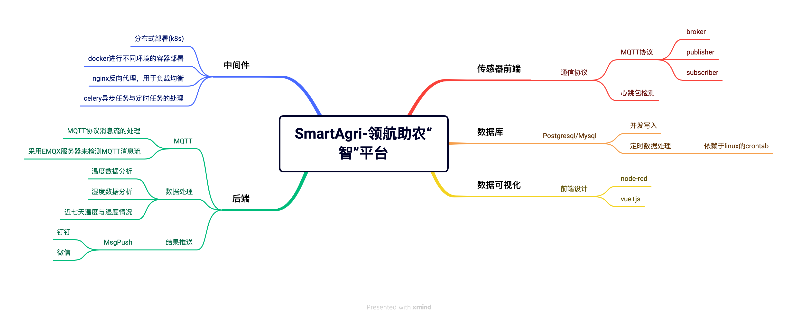

## 计算机设计大赛-物联网组别
### Topic: "SmartAgri-领航助农“智”平台"

### 一、本项目的架构图如下：

### 二、项目实现
**项目实现大致思路如下：**

1.数据采集：采用代码实现MQTT传感器端的数据采集，并将采集到的数据处理成jsonStr的格式上传到server端

2.数据写入：Server端通过端口监听进行数据监测，如果接收到Client端上传的数据,则进行异步操作，将jsonStr数据解析之后写入数据库中  

3.数据处理：通过封装好的函数定时调用，分析处理数据库中的数据，分析大棚中对应植物区的温度及其湿度，与给定的最佳温度湿度进行比对，再进行信息回传上报  

4.数据可视化：通过Node-red订阅MQTT的信息服务器（EMQX）再通过自己编写的前端对接收到的数据进行处理，并显示在web平台上，将数据进行可视化  

5.方便部署及集群化部署：通过使用Docker容器技术以及K8s集群化部署来实现快速的部署。

### 三、项目部署
项目整体目录如下：
|—Docs                   # 存放设计文档
|—src—Fronted     # 存放前端代码
|—app.py     # flask后端程序
|—backend.py       # 传感器后端程序
|—Common.py     # 通用类
|—config.py    # 配置文件
|—Dbconn.py    # 数据库驱动程序
|—fronted.py    # 传感器前端节点程序
|—GetData.py       # 数据库驱动程序的封装
|—init.sh          # 数据库建设脚本
|—README.md     # 项目手册
1.首先需要确保本地环境已经安装Mysql、EMQX、Python3.6-3.8、Vue等项目所需的基础环境。 

2.首先需要启动emqxMQTT服务器，启动指令是 ./bin/emqx start （这里的./必须应当是emqx所在的目录） 

3.采用物理机安装Mysql，首先需要启动Mysql数据库，mysql建表脚本已封装为bash脚本，需要将数据库用户名设置为root,密码为123456，端口为3306，数据库名为agriculture,设置好之后可以通过bash init.sh进行快速建表。

4.成功启动完成EMQX和Mysql并且建好表之后，进入项目的src目录下，依次运行fronted.py与backend.py两个脚本文件，该脚本实现了前端传感器的模拟以及向数据库中上传传感器监测到的数据这一操作，指令分别为python3 fronted.py 和 python3 backen.py。
如果控制台输出 

“接收到传感器编号为 sensor3 的温度数据，温度为: temperature = 26 °C,更新时间是 2023-04-08 17:08:52
[+]记录成功” 
 样式的文本，则视作启动成功。至此传感器端启动完成。

5.运行app.py启动后端，输入python3 app.py启动后端，运行成功后控制台输出
* Running on http://127.0.0.1:5000 (Press CTRL+C to quit) ，若出现以上字样，则表示启动成功。
* 
6.进入./src/Fronted/目录下，输入指令npm run serve，启动前端，若控制台输出
  App running at:
  - Local:   http://localhost:8080/
  - Network: http://ip地址:8080/
则表示前端启动，此时打开浏览器，访问 http://localhost:8080/#/login则可成功进入项目主页面，默认账号密码为admin/admin
本项目已实现服务器部署，访问链接： http://43.143.246.73:8000/#/login

项目实现照片：

**本人的观点是这个比赛非常水，评奖机制很玄幻，且含金量低，不建议参加,有时间不如参加一下软件杯，智能车，ACM或者CTF这种含金量较高且相对公平一些的比赛，仅个人想法**
